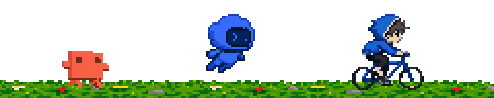

<!-- ROOM-START -->

<!-- ROOM-END -->

<h1 align="center">Hi 👋, I'm anionex

  

<!-- RANK-START -->

<!-- RANK-END -->

</h1>

<picture>
  <source
    srcset="https://github-readme-stats-kappa-sooty-66.vercel.app/api?username=Anionex&show_icons=true&theme=dark"
    media="(prefers-color-scheme: dark)"
  />
  <source
    srcset="https://github-readme-stats-kappa-sooty-66.vercel.app//api?username=Anionex&show_icons=true"
    media="(prefers-color-scheme: light), (prefers-color-scheme: no-preference)"
  />
  
</picture>

 

* 🌐 中文 · English
* 🏄‍♂️ A Gen Z tinkerer
* 🔗 Website: [anionex.me](https://anionex.me)
* 📚 Interests: LLMs, AIGC, deploying models, trying new things
* 🧪 Currently interning at [DCAI](https://x.com/PKU_DCAI)
* 📫 Reach me at: [davidyang042@gmail.com](mailto:davidyang042@gmail.com)

## 🛠️ projects

**I built an AI-native slides generator 🍌 [banana-slides](https://github.com/Anionex/banana-slides)** (15k⭐) [overnight](https://github.com/Anionex/banana-slides/compare/50d79ea220ba49219b1e05f1701224a9d7f5dda8...64ffd59d067ce737c63431c4f7608902896d7020). 

also built:
* [agent-vision-toolkit](https://github.com/Anionex/agent-vision-toolkit) — A vision toolkit for text-only agents handling multi-step visual tasks
* [treeAI](https://github.com/Anionex/treeAI) — chat with LLMs in the form of a tree
* [cherry-studio-with-js-plugins](https://github.com/Anionex/cherry-studio-with-js-plugins) — a plugin system for Cherry Studio

**Some open-source projects I've contributed to:**
* [vllm-project/vllm](https://github.com/vllm-project/vllm)
* [vercel-labs/agent-browser](https://github.com/vercel-labs/agent-browser) 
* [vllm-project/vllm-ascend](https://github.com/vllm-project/vllm-ascend)
* [OSU-NLP-Group/TravelPlanner](https://github.com/OSU-NLP-Group/TravelPlanner) 
  

<!--

-->
